### Development/Test Environment

- Language: **Python 3.11** 
- RPC Framework: **gRPC**
- OS: **Linux/Windows**

### Design Considerations

Constraints:
- N >= 8
- 0 <= Si <= 4
- 0 < t <= T
- M >= 2

- Minimum board size is **8**
  - If an M4 missile lands directly in the center of 7x7 grid, it will cover the entire grid and the game may end in a 
    single round itself
  - Just to allow reasonable progress of the game, we have specified this constraint
- Since the commander initiates any messages, the commander runs a gRPC client while the soldiers 
  run gRPC servers
  - _M-1_ soldiers need to be started first before the commander can be started
- Commander needs to know the ip addresses of the soldiers to be able to communicate to them. This is achieved using listing soldier ip addresses in _config.toml_ file
- Players are allowed to share cells on the board
- To decouple the RPC from the core behavior of the soldiers, the RPC service takes the soldier (and a commander) as a 
  dependency
- To simplify configuring the commander, a _config.toml_ file (documented in [readme.txt](./readme.txt)) is used

_Note: The code contains detailed documentation and comments wherever appropriate_

## Working
  ### RPC messages
  - `StartupStatus` - Commander tells each soldier their soldier_id and board_size. Using this the soldier takes initial position.
  - `MissileApproaching` - Commander tells each soldier the type and position of approaching missile
  - `RoundStatus` - At the end of each round, Commander checks which soldiers are alive. To this, soldiers reply either that they are _hit_ or give their updated location
  - `NewCommander` - If commander is hit, it sends all the hyperparameters and metadata to newly elected commander. On receiving, the new commander takes up the duties of commander


___

### Testing

Since the game is designed to be completely random (including starting positions and speeds), it is not possible to 
force certain conditions without modifying the code. Nevertheless, we have tested with variations of the 
hyperparameters (including illegal values) specified via the configuration file.

Inputs:

```toml
N = 8
M = 6
t = 3
T = 15
```

Scenarios:

- Simulation 1
  - Starting position

    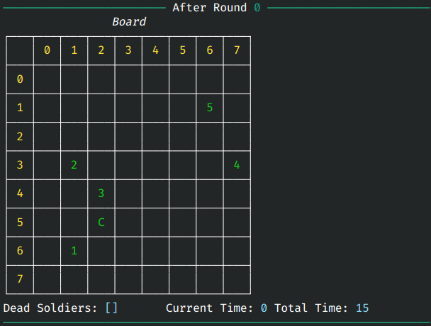
  - Output at soldier 5

    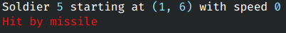
  - Board after missile hit
    
    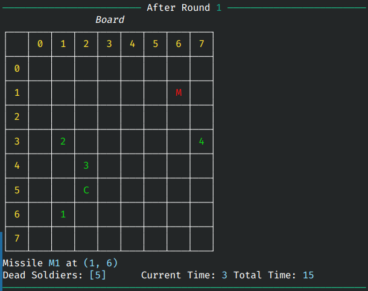
  - Soldiers sharing cell after escaping missile
    
    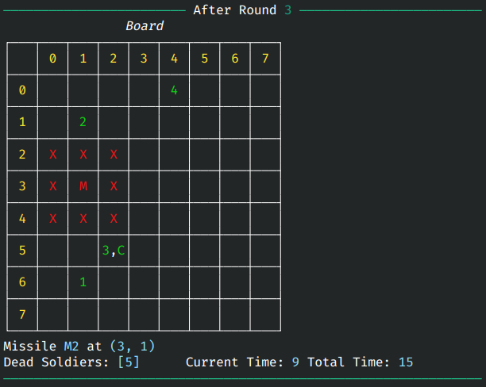
  - Game won
    
    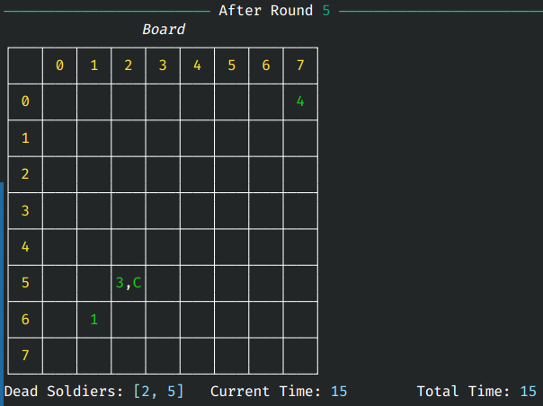

- Simulation 2
  - Starting position

    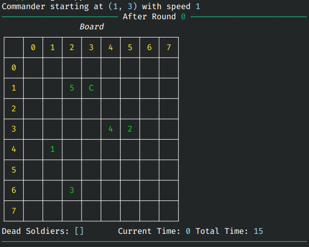
  - Commander hit by missile
  
    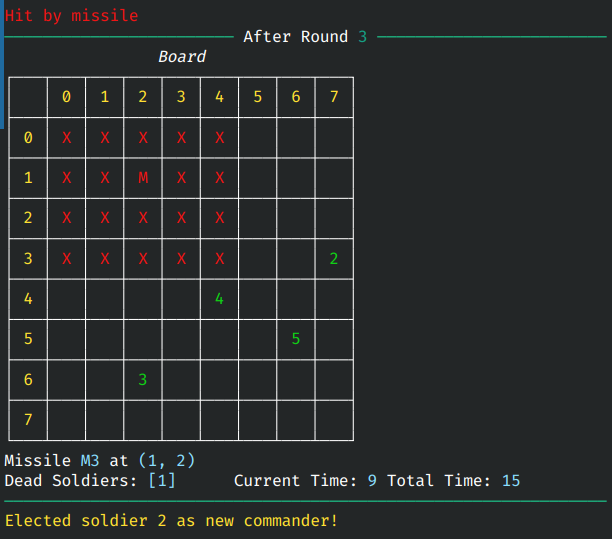
  - New commander resuming duties
  
    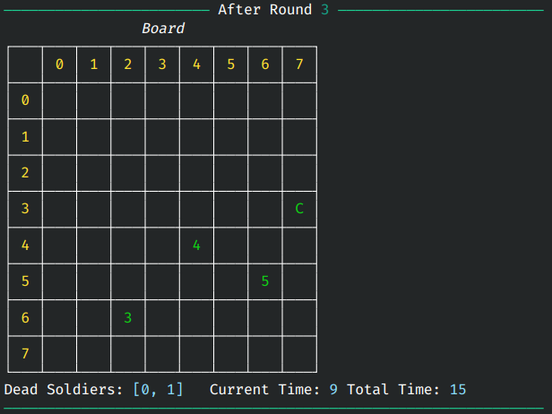
  - Winning with 50% alive soldiers
  
    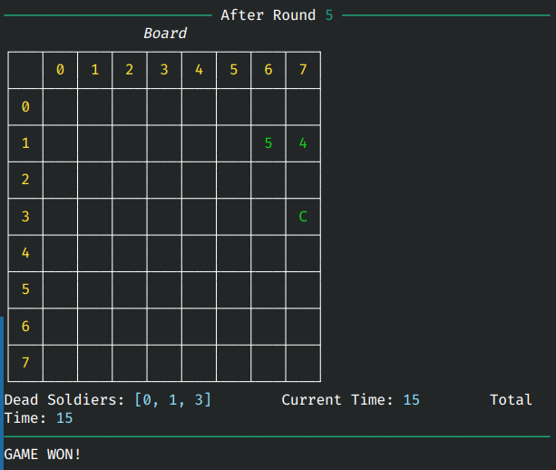

- Simulation 3
  - Starting position
  
    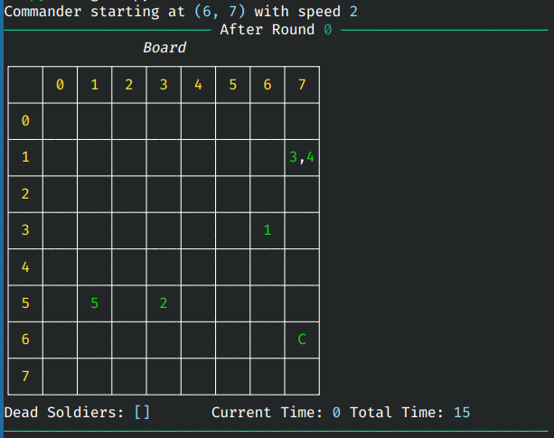
  - Round 1
  
    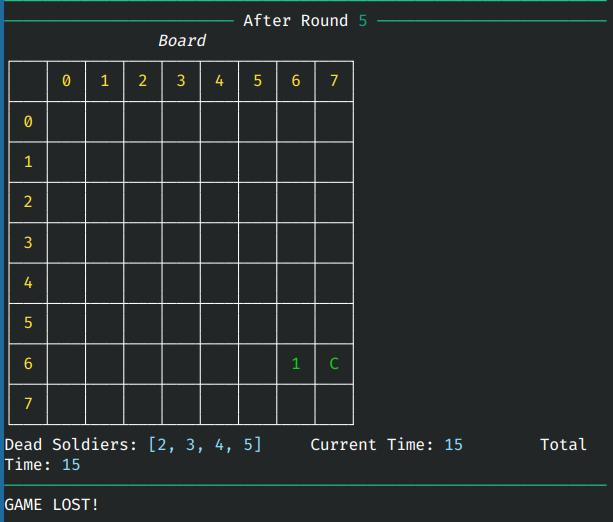
